# 碎银 v4 SDD — 流程图集

> 把所有讨论过的流程图集中在一处，方便打开慢慢思考。Mermaid 在 GitHub 自动渲染。
> 语义和细节参见 `workflows.md` / `toolchain.md` / `discussion-notes.md`。

---

## 1. 4 层级关系

**回答**: v4 项目的产物分几层？每层修改频率和影响面如何？

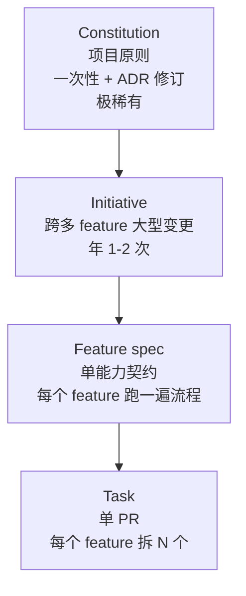

修改自下而上传染：改 Constitution 可能 cascade 到所有；改 Initiative cascade 到多个 feature；改 feature cascade 到自己的 tasks。

---

## 2. Feature 主流程 - 完整状态机（含 Plan 内部循环 + 异常）

**回答**: 一个 feature 从想法到生产，AI 和人怎么走？

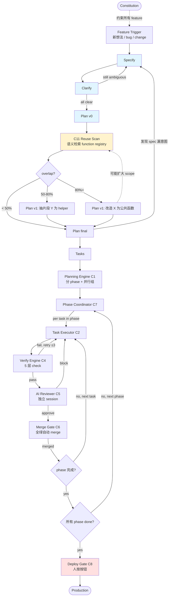

**颜色**: 蓝 = 协商阶段（人参与）；黄 = 重复检查；红 = 人按按钮。

异常退出（任何节点都可能触发）见 §7。

---

## 3. Plan 内部循环放大 - plan ⇌ reuse-scan + 抽取 3 档决策

**回答**: Plan 阶段不是单次起草，是带循环的子流程。抽取决策的 3 档怎么走？

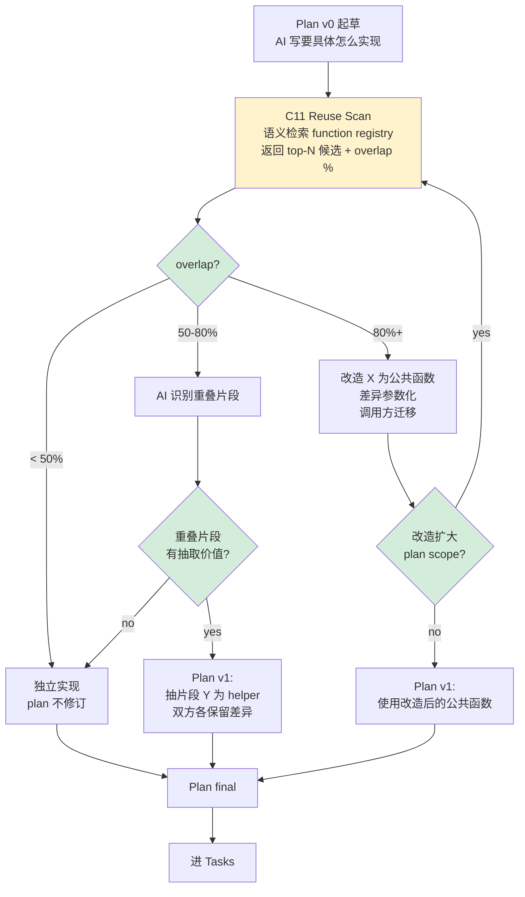

**通用循环模式**:

| 阶段 | 单次产出？ | 反向触发 |
|---|---|---|
| specify ⇌ clarify | ❌ 多版本 | clarify 找漏 → specify 修订 |
| **plan ⇌ reuse-scan** | ❌ **多版本** | reuse-scan 找重复 → plan 修订 |
| implement → verify | ✅ 单次 + retry | verify 失败 → 修 impl |

---

## 4. Bug 流程 - 4 种 Type 分流

**回答**: 报告一个 bug，根据 type 走不同路径？

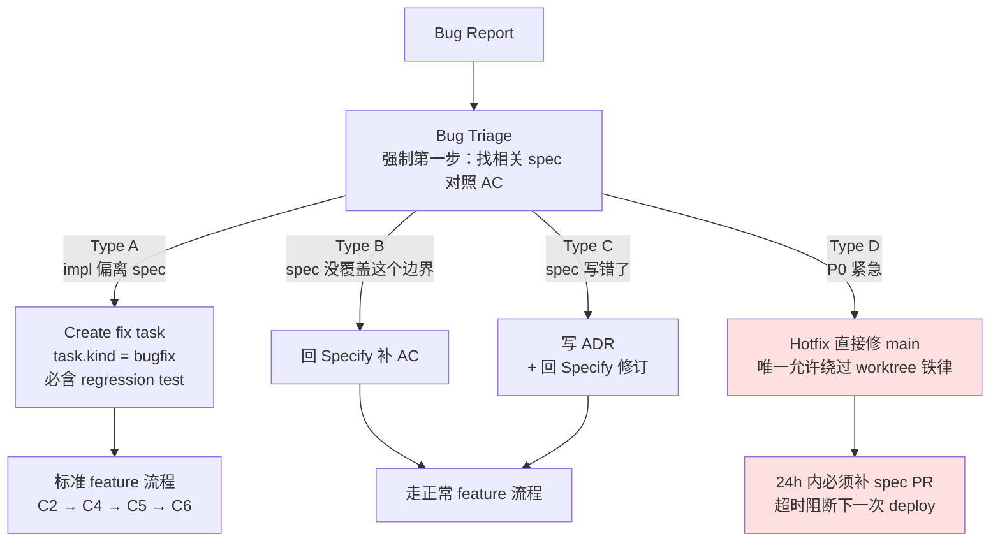

---

## 5. Initiative 流程 - 大型变更（跨多 spec）

**回答**: 技术栈切换 / 重构这种跨多个 feature 的变更怎么走？

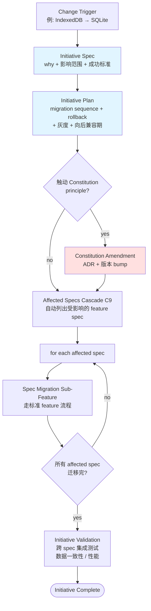

---

## 6. 异常退出 - 任何节点都可能触发

**回答**: AI 跑到一半发现不对怎么办？

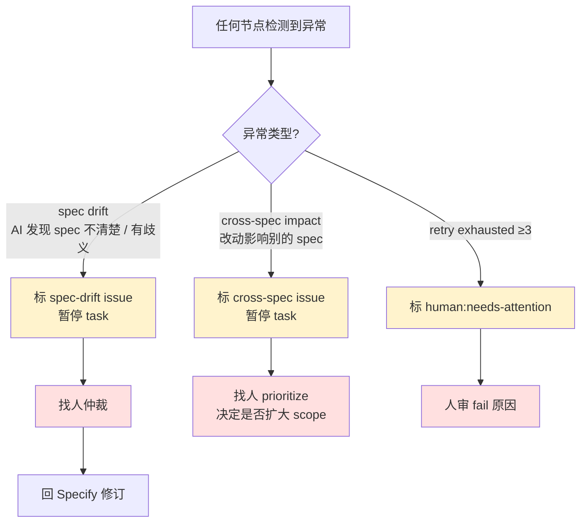

3 种异常都需要**人介入**——这跟 L1.D-business profile 一致：执行阶段 AI 自闭环，异常时人才出来。

---

## 7. 复杂度治理 - 6 层防御机制（覆盖整个流程）

**回答**: 代码复杂度在每个流程节点怎么被治理？

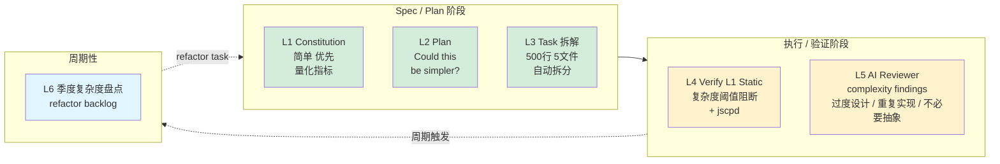

**颜色**: 绿 = 协商时介入（最早）；黄 = 执行时介入（自动）；蓝 = 周期介入（兜底）。

---

## 8. 代码复用治理 - 4 层防御机制

**回答**: spec / code 两个层级的重复怎么各管各的，又互相配合？

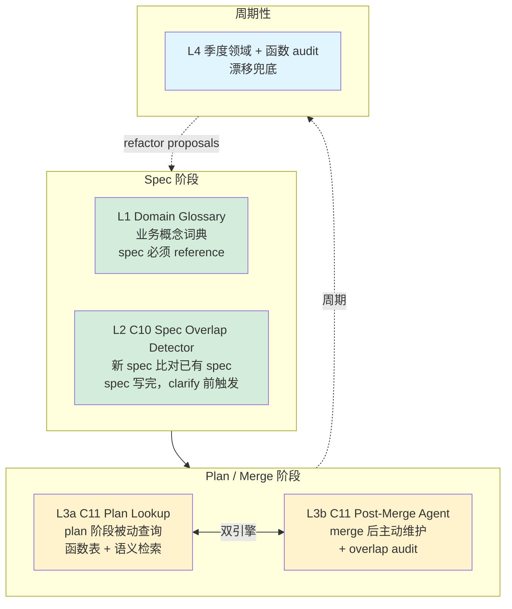

L3 是工具链最复杂的一层——**双引擎**互相喂数据。

---

## 9. C11 双引擎流程 - Plan Lookup + Post-Merge Agent

**回答**: C11 的两个查询接口具体怎么跑？谁喂谁？

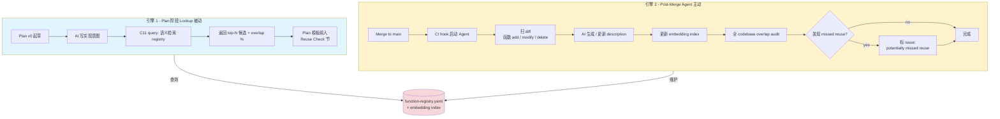

**关键**: 两个引擎共享 `function-registry.yaml` 这个**单一数据源**。维护引擎写入，查询引擎读取，永远保持一致。

---

## 10. Spec ↔ Code 双向追踪 - 锚点网络

**回答**: 改一个函数，怎么知道影响哪些 spec？反过来：spec 改了，怎么找到对应代码？

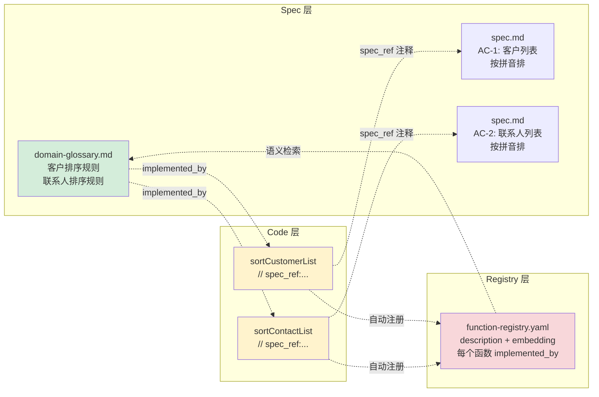

**追踪方向**:

- **改函数** → 看注释里的 `spec_ref` → 知道影响哪些 spec
- **改 spec** → 看 glossary 的 `implemented_by` → 知道改哪些函数
- **写新 spec** → 语义检索 registry → 知道有没有重复

这是 spec rot 防御的**最强形态** —— 不靠"季度对账"，靠"改代码时就知道影响哪个 spec"。

---

## 11. 完整工具链组件全景 - Layer 1-6 + 8+3 个组件

**回答**: v4 工具链有多少组件？各在哪一层？谁依赖谁？

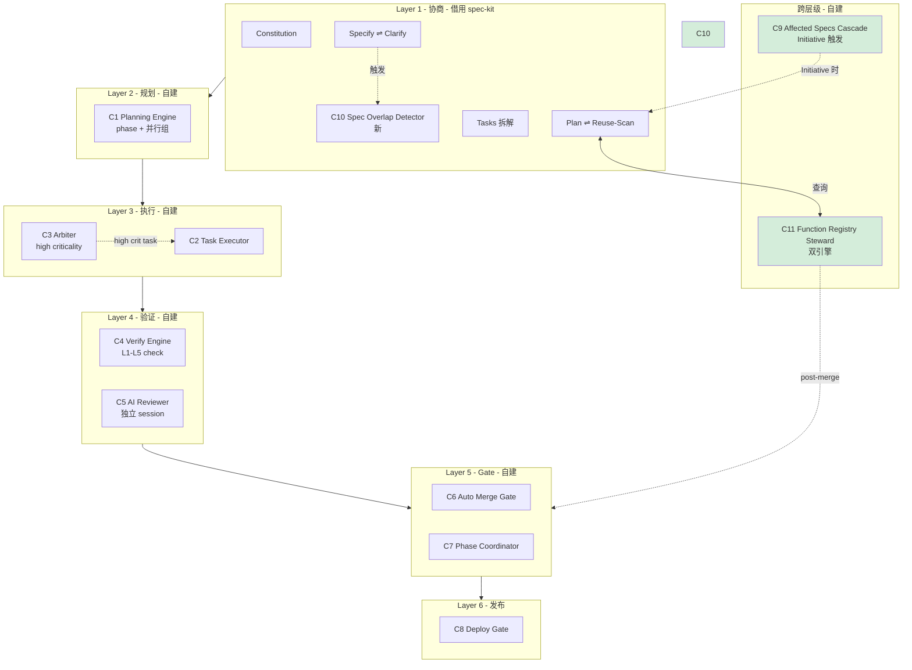

**统计**: 11 个组件 = 8 个原方案 + 3 个本次讨论新增（C9 / C10 / C11）。

---

## 索引

| 图 | 回答的问题 |
|---|---|
| 1. 4 层级关系 | 产物分几层？修改频率？|
| 2. Feature 主流程完整图 | 一个 feature 怎么走完？|
| 3. Plan 内部循环放大 | 抽取决策 3 档具体动作？|
| 4. Bug 流程 | 4 种 Type 分别怎么走？|
| 5. Initiative 流程 | 大型变更怎么管？|
| 6. 异常退出 | AI 跑偏怎么办？|
| 7. 复杂度治理 6 层 | 每个流程节点怎么治复杂度？|
| 8. 代码复用治理 4 层 | spec / code 重复各管什么？|
| 9. C11 双引擎流程 | 函数表怎么查 + 怎么维护？|
| 10. Spec ↔ Code 双向追踪 | 怎么知道改函数影响哪些 spec？|
| 11. 完整组件全景 | 11 个组件都在哪？谁依赖谁？|

---

**Version**: 0.1.0-WIP
**Last Updated**: 2026-05-15
