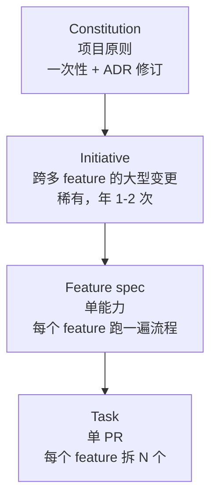
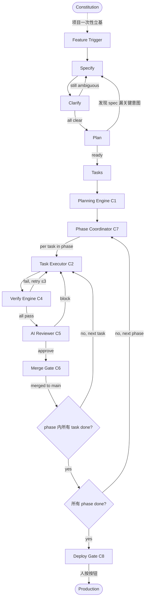
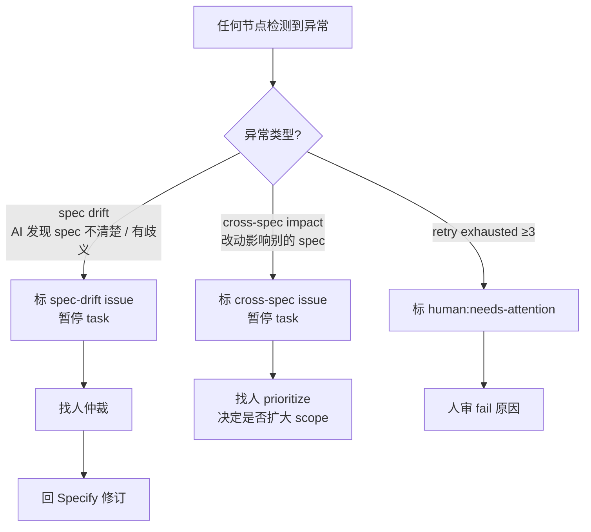
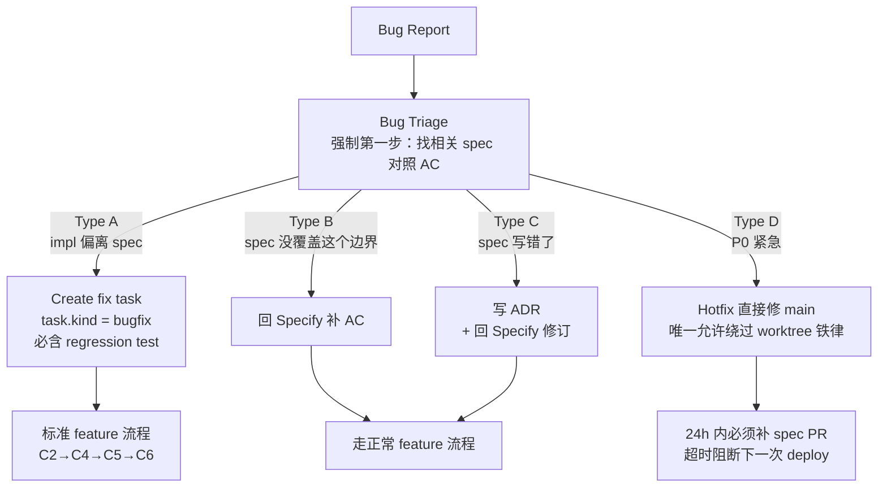
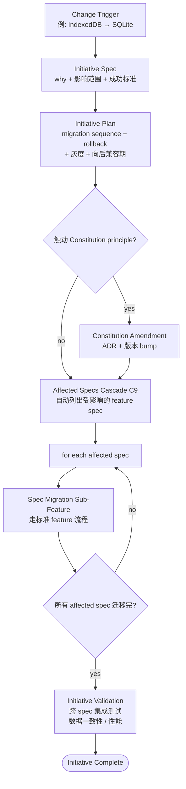

# 碎银 v4 工作流 — 状态机与流程图

> 本文档定义 v4 SDD 工具链的**状态机和异常路径**。跟 `toolchain.md` 的关系：
>
> - `toolchain.md` 定义"有哪些工具"（**节点** + 输入输出 + 能力）
> - **本文档定义"工具之间怎么跳"**（**边** + 转移条件 + 异常出口 + 高层级流程）
>
> 两份一起 = 工具链完整规约。

---

## 一、层级关系

v4 项目的产物分 4 个层级，每个层级的生命周期、修改频率、影响面不同：



| 层级 | 修改频率 | 影响面 |
|---|---|---|
| Constitution | 极稀有，每次需 ADR + 版本 bump | 全项目 |
| Initiative | 稀有，年 1-2 次 | 跨多个 feature spec |
| Feature spec | 常规，每个 feature 一次 | 单一能力 |
| Task | 高频，每个 feature N 个 | 单 PR |

---

## 二、主流程状态机（Feature-level）

### 正常路径



### 异常退出（任何节点都可能触发）



3 种异常都需要人介入——这跟 L1.D-business profile 一致：执行阶段 AI 自闭环，**异常时人才出来**。

### 边的判定规则（spec 阶段要钉死的）

下表的"触发 signal"列是后续 spec 阶段的关键设计决策：

| 边 | 起点 | 终点 | 触发 signal |
|---|---|---|---|
| spec ↔ clarify 反复 | Clarify | Specify | clarify 输出含 unresolved questions |
| plan → spec（回头） | Plan | Specify | plan 阶段 AI 发现"实现 X 必需的意图 spec 没说"|
| verify fail → retry | Verify | Task Executor | verify_report.checks 含 fail |
| review block → retry | AI Reviewer | Task Executor | verdict == "block" 或 "request_changes" |
| spec drift exception | 任何节点 | Specify (via issue) | AI 实现/审查中发现 spec 自相矛盾 / 有歧义 |
| cross-spec exception | 任何节点 | 人介入 | diff 影响的文件被其他 spec 引用 |
| retry exhausted | retry loop | 人介入 | 计数器 ≥3 |

**未决：drift / cross-spec exception 的 AI 自检 prompt 怎么写**（Q10 — 新加，归到 C2/C4/C5 各自）

---

## 三、Bug 流程



**Type D 的兜底**：hotfix 自动创建一个 "back-fill spec" issue，倒计时 24h。超时 → CI 阻断下一次 deploy（不补 spec 就别想发版）。这是工程化硬约束，防"hotfix 永远不补"。

**找不到相关 spec 的处理**：

- 这能力还没 SDD 化 → 标记 `legacy-code`，开"补 spec" task
- spec 体系有盲区 → 开新 spec（Type B 路径）
- **两种情况都不允许"直接改代码绕过"**

---

## 四、Initiative 流程（大型变更）

例子：早期 spec 选了 IndexedDB，后期要加 app 端需要 SQLite——这是技术栈切换，影响多个 feature spec，可能还要改 Constitution。



### Initiative 的 3 个独立产物

```
initiatives/
└── NNN-<initiative-name>/
    ├── spec.md          ← 为什么变、影响范围、成功标准
    ├── plan.md          ← 迁移顺序、rollback 策略、灰度方案
    └── affected.yaml    ← C9 自动生成，每个受影响 spec 的迁移子任务
```

### Initiative vs N 个独立 feature 的区别

**Initiative 不是"开 N 个 feature spec"**：

| | N 个独立 feature | 1 个 Initiative |
|---|---|---|
| 成功标准 | 各自独立 | **统一**（所有子任务合在一起才算成功） |
| Rollback | 各自独立 | **统一**（要么全切、要么全回滚）|
| 验证 | 各 spec 内验证 | **跨 spec 集成验证**（必须） |
| 时间窗 | 分散 | 通常需要在向后兼容期内完成 |

---

## 五、新组件需求 — C9 Affected Specs Cascade

Initiative 流程引入的新工具，归 Layer 2（规划）：

| 项 | 内容 |
|---|---|
| **作用** | 给定 Initiative 意图，自动扫所有 feature spec 找出受影响的，生成 migration checklist |
| **输入** | Initiative Spec + 所有现存 feature spec（`specs/*/spec.md`、`specs/*/plan.md`） |
| **输出** | `affected.yaml` — 受影响 spec 列表 + 每个 spec 的影响范围 + 建议迁移顺序 |
| **核心能力** | 跨 spec 依赖分析 / 影响传播图 / 迁移顺序优化（先无依赖的，再依赖链上的） |
| **依赖** | 现存 specs 索引、Initiative Spec |
| **未决 Q11** | 影响范围判定的精度（false positive 会扩大迁移范围） |

### C9 vs C1 — 都是依赖图分析，颗粒度不同

- **C1 Planning Engine**: feature 内的 task 分析（"哪些 task 可并行"）
- **C9 Affected Specs Cascade**: project 级的 spec 分析（"哪些 spec 受 Initiative 影响"）

---

## 六、未决问题汇总（含本文档新增）

| 编号 | 问题 | 涉及 |
|---|---|---|
| Q1 | 语义冲突分析的精度 | C1 |
| Q2 | 单 AI session 长度上限 | C2 |
| Q3 | 仲裁 AI 是独立 session 还是 reviewer 兼任 | C3 |
| Q4 | AC ↔ test 映射强制方式 | C4 |
| Q5 | AI Reviewer 单次还是 N=2 分歧仲裁 | C5 |
| Q6 | Merge Gate 升级通知渠道 | C6 |
| Q7 | phase 内 task 卡住，已 merge 的回滚还是隔离 | C7 |
| Q8 | Deploy Gate 风险 summary 格式 | C8 |
| **Q9** | **drift / cross-spec exception 的 AI 自检 prompt 怎么写** | C2 / C4 / C5 |
| **Q10** | **Bug Type D 24h 倒计时具体实现**（CI 怎么阻断 deploy） | C8 / 工程化 |
| **Q11** | **C9 影响范围判定的精度** | C9 |

---

## 附录：跟其他文档的关系

| 文档 | 内容 | 读者 |
|---|---|---|
| `methodology.md` | 方法论原则（spec 怎么写、bug 怎么分类） | 团队所有人 |
| `toolchain.md` | 工具链需求（节点定义）| 工具链开发者 |
| **`workflows.md`（本文档）** | **状态机（边）+ 高层级流程**| 工具链开发者 + 流程理解者 |
| `constitution.md`（未来） | 项目宪法（不可妥协 + 治理） | 团队对齐 |

3 份文档共同构成 v4 工具链的完整规约——节点（toolchain.md）、边（workflows.md）、原则（constitution.md），其上是方法论（methodology.md）。

---

**Version**: 0.1.0-draft
**Last Updated**: 2026-05-15
